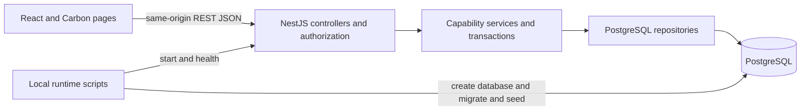

# HR-Prototype architecture

## Architecture

```mermaid
flowchart LR
  Browser[React and Carbon pages] -->|same-origin REST JSON| API[NestJS controllers and authorization]
  API --> Services[Capability services and transactions]
  Services --> Repositories[PostgreSQL repositories]
  Repositories --> Database[(PostgreSQL)]
  Startup[Local runtime scripts] -->|start and health| API
  Startup -->|create database and migrate and seed| Database
```

## Reading

The [overview](../overview.md) owns these boundaries. This diagram describes the intended build; it is not evidence of running components.
