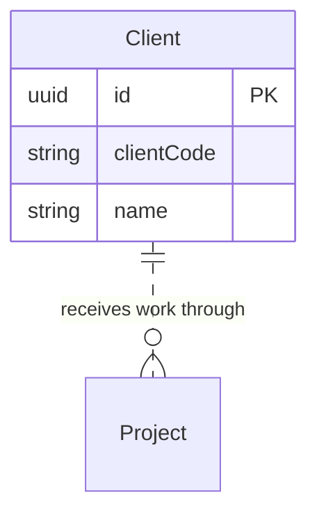

# Client logical data model

```mermaid
erDiagram
  Client {
    uuid id PK
    string clientCode
    string name
  }
  Client ||..o{ Project : "receives work through"
```

## Reading

Client is primary. A client may receive work through many Projects; each Project delivers work for one Client. Project is external.
